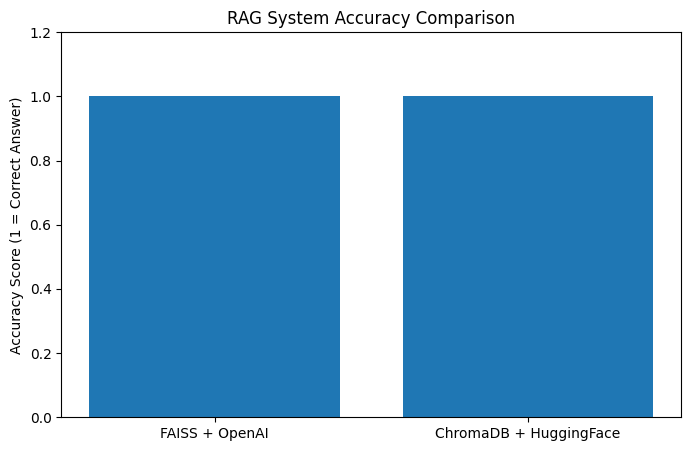
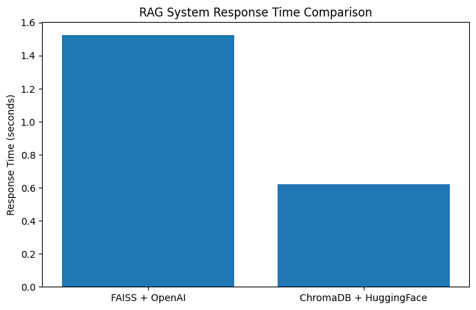

# RAG Comparison: FAISS + OpenAI vs ChromaDB + HuggingFace

## Overview
This project compares two Retrieval-Augmented Generation (RAG) pipelines using different vector databases and embedding models. The goal is to evaluate system performance based on response accuracy, response time, and setup complexity when retrieving information from a renewable energy dataset.

Two systems were compared:

- FAISS + OpenAI Embeddings
- ChromaDB + HuggingFace Embeddings

Both pipelines were implemented using LangChain.

---

## Dataset
The dataset was created from the Wikipedia page on Renewable Energy.

Steps followed:

1. Load webpage using LangChain WebBaseLoader
2. Split the text into chunks using RecursiveCharacterTextSplitter
3. Convert chunks into embeddings
4. Store embeddings inside vector databases

---

## Test Query

The same query was used for both pipelines.

Query:

What are the main types of renewable energy sources?

Expected answer includes:

- Solar energy  
- Wind energy  
- Hydroelectric power  
- Geothermal energy  
- Biomass energy  

Both systems successfully retrieved relevant context and produced correct answers.

---

## Project Structure

```
📦 Lab 6 
│
├── 📄 RAG_Simran_Sinha.ipynb
│
├── 🎞️ Accuracy.png
│
├── 🎞️ Time.png
│
├── 📄 Simran Sinha_RAG Report.pdf 
│
└── 📘 README.md
```

---
## System Architecture

Pipeline Workflow

Web Data → Text Chunking → Embeddings → Vector Database → Retrieval → LLM Response

System Configurations

| System | Vector Database | Embeddings |
|------|------|------|
| System 1 | FAISS | OpenAI |
| System 2 | ChromaDB | HuggingFace |

---

## Results

### Accuracy Comparison

Both RAG systems produced correct answers for the test query.



Observation:

Both systems achieved the same accuracy for the test query.

---

### Response Time Comparison



| System | Response Time |
|------|------|
| FAISS + OpenAI | 1.52 seconds |
| ChromaDB + HuggingFace | 0.62 seconds |

Observation:

ChromaDB + HuggingFace responded faster than FAISS + OpenAI.

---

## Setup Complexity

| System | Setup Complexity |
|------|------|
| FAISS + OpenAI | Easy |
| ChromaDB + HuggingFace | Medium |

Explanation:

FAISS + OpenAI  
- Easy integration  
- Requires OpenAI API  

ChromaDB + HuggingFace  
- Open-source embeddings  
- Requires additional dependencies  

---

## Pros and Cons

### FAISS + OpenAI

Pros
- Easy integration
- High-quality embeddings
- Simple setup

Cons
- Requires OpenAI API
- May incur API cost

---

### ChromaDB + HuggingFace

Pros
- Open-source embeddings
- Faster response time
- No external API dependency

Cons
- Slightly more setup complexity
- More dependencies required

---

## Key Observations

- Both RAG systems generated accurate responses using the same dataset.
- ChromaDB + HuggingFace showed faster response speed.
- FAISS + OpenAI is simpler to implement.
- Choice of system depends on project requirements such as speed, cost, and complexity.

---

## Conclusion

Both RAG pipelines successfully retrieved relevant information and generated accurate responses. FAISS + OpenAI offers simpler implementation and high-quality embeddings. ChromaDB + HuggingFace provides faster response time and uses fully open-source embeddings. The best choice depends on project requirements such as cost, speed, and system complexity.

---

## Notes

This lab is intended for academic learning and experimentation purposes. Model outputs should not be assumed to be correct without verification, especially in high-stakes or real-world applications.

