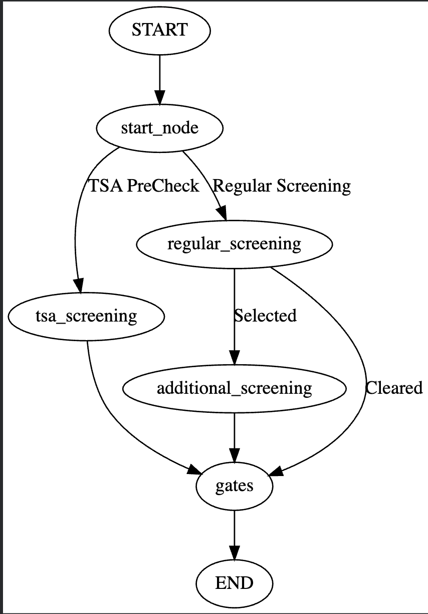

# Lab 7 – Introduction to LangGraph

## Overview

This lab demonstrates how **LangGraph** can be used to model workflows using a graph-based execution system.
The project simulates an **airport security screening workflow**, where passengers move through different screening paths before reaching the departure gates.

The lab focuses on workflow modeling, conditional routing, state transitions, and graph execution using LangGraph.

---

## Workflow Diagram

```

```
Passengers can follow different paths:

* TSA PreCheck → Gates
* Regular Screening → Gates
* Regular Screening → Additional Screening → Gates

This workflow demonstrates branching, conditional routing, and path merging in LangGraph.

---

## Project Structure

```
📦 Lab 7/
│
├──📄 Introduction to LangGraph.pdf        – Lab report
│
├── 📄 LangGraph_Intro.ipynb               – Implementation notebook
│
├── 🎞️ Workflow.png                         – Workflow graph visualization
│
└── 📘 README.md                            – Project documentation
```

---

## Nodes in the Workflow

The workflow graph contains the following nodes:

| Node                 | Description                   |
| -------------------- | ----------------------------- |
| start_node           | Passenger arrives at security |
| tsa_screening        | TSA PreCheck screening        |
| regular_screening    | Regular security screening    |
| additional_screening | Additional screening          |
| gates                | Passenger goes to gates       |
| END                  | Process completed             |

Each node represents a step in the airport security workflow.

---

## Conditional Routing Logic

Two decision points were implemented in the workflow:

### Passenger Type Decision

* 20% → TSA PreCheck
* 80% → Regular Screening

### Additional Screening Decision

* 10% → Additional Screening
* 90% → Cleared to Gates

These probabilities determine the path taken through the workflow.

---

## Graph Execution

The workflow graph is executed using:

```
graph.invoke({})
```

Each execution may produce different paths depending on the decision probabilities.

### Example Paths

* Passenger → TSA PreCheck → Gates → End
* Passenger → Regular Screening → Gates → End
* Passenger → Regular Screening → Additional Screening → Gates → End

---

## Key Concepts Learned

This lab covers the following concepts:

* LangGraph workflow modeling
* State graphs
* Nodes and edges
* Conditional routing
* Decision-based workflows
* Graph execution
* Workflow visualization

---

## Conclusion

This lab demonstrates how LangGraph can be used to model workflows with conditional routing and probabilistic decision-making.
The airport security simulation shows how graph-based execution can represent real-world workflow systems and decision processes.

---


